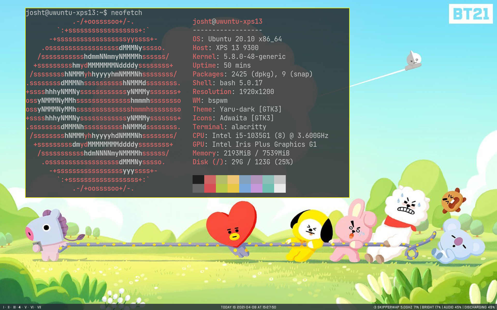
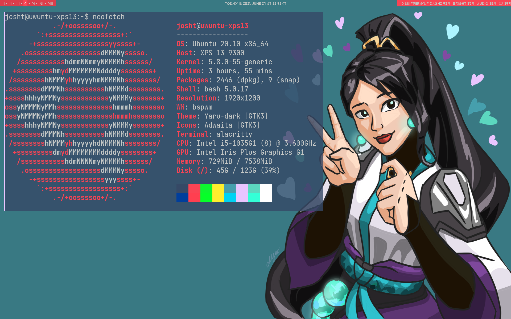

# dotfiles
**NOTICE:** currently under construction

various configs I use for my laptop
## Scripts
`save.sh` Copy files from `$HOME/.config` into repository
### Screenshots

## Todo:
- add a script to switch between bt21, sage, and any future themes
- add install script
