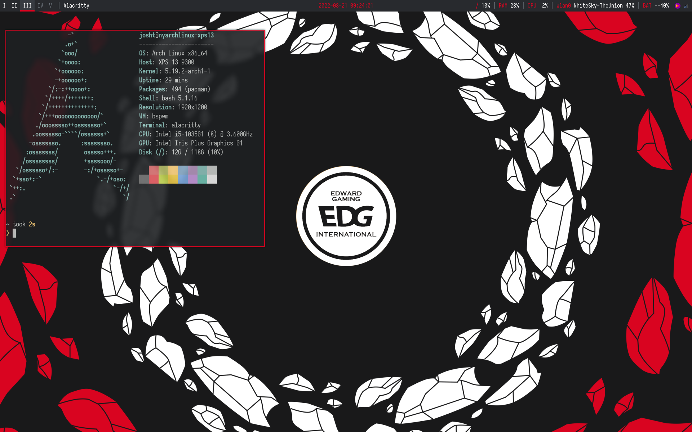

# dotfiles
**NOTICE:** currently under construction, scripts (and everything else here) are provided as-is

## packages
- `bspwm` and `sxhkd`
- `picom`
- `polybar` for the bar
- `rofi` for application search and power menu (shoutout to [adi1090x](https://github.com/adi1090x) for configs!)
- `eww` for dashboard (again, based off of `adi1090x`'s configs)
- `dunst`, `flameshot` for notifications and screenshot utilities
- `alacritty` for terminal emulator
- `thunar` and `ranger` for file managers
- `betterlockscreen` for lock screen
various configs I use for my laptop
## Scripts
`save.sh` Copy files from `$HOME/.config` into repository

`load.sh` Load files from a theme into `$HOME/.config`

`sw-common.sh` Copy theme-agnostic files into repository
### Screenshots

## Wallpapers
- Starfall wallpaper is from endmion1 on Instagram
- BT21 wallpaper from Google
- Sage wallpaper is made by a friend
- EDward Gaming wallpaper is by [/u/Wasteak](https://www.reddit.com/r/leagueoflegends/comments/q5arsx/worlds_2021_wallpapers/)
- Samurai Doge (used for lockscreen) is found on [alphacoders.com](https://wall.alphacoders.com/big.php?i=1151373)

## Todo:
- add a script to switch between bt21, sage, and any future themes
- add install script
